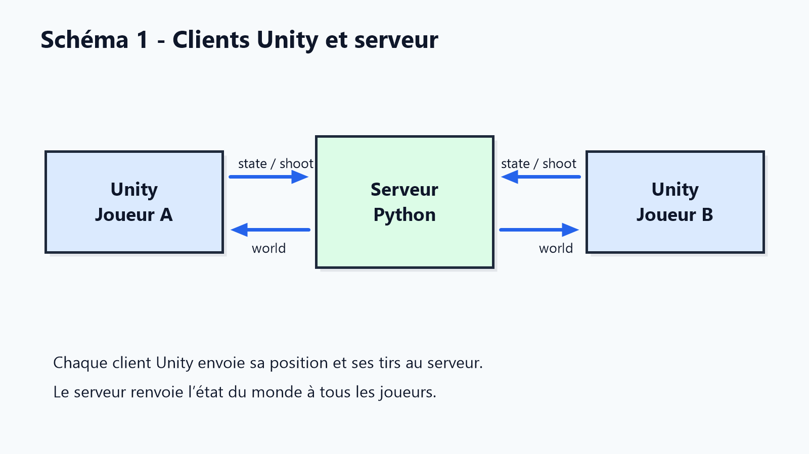
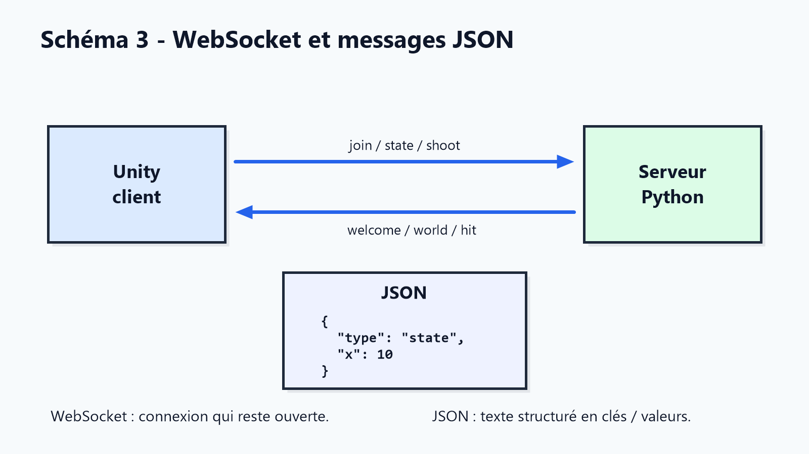
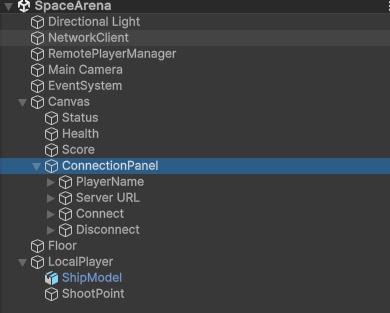

# Cours 1 - Client Unity reseau JSON/WebSocket

Bienvenue dans notre dernier projet de l'année !

Aujourd'hui, on va coder un jeu de vaisseau spaciaux multijoueurs. Tu ne vas pas creer toute la scene Unity et tu ne vas pas coder le serveur. La scene est deja prete, le serveur tourne deja sur Internet, et ton objectif est de completer les morceaux de code importants pour que Unity parle avec le serveur.

A la fin du cours, ton jeu devra pouvoir se connecter au serveur, envoyer ta position, afficher les autres joueurs, et envoyer/recevoir des tirs.

## Objectifs

Tu vas comprendre et coder :

- ce qu'est un serveur
- ce qu'est un WebSocket
- ce qu'est un message JSON
- comment Unity envoie des messages au serveur
- comment Unity lit les messages du serveur
- comment un autre joueur apparait dans ta scene

## Avant de coder : le reseau du jeu

Regarde ce schema :



Un jeu multijoueur a besoin d'un endroit commun ou tous les joueurs se retrouvent. Cet endroit, c'est le **serveur**.

Dans notre jeu :

- ton Unity est un **client**
- le Unity d'un autre joueur est aussi un **client**
- le serveur recoit les messages de tous les clients
- le serveur renvoie l'etat du monde a tout le monde

### C'est quoi un serveur ?

Un serveur est un programme qui reste allume et attend des messages.

Exemple :

```text
Unity dit : "Je suis Erwann, je suis a la position x=10, y=5, z=2"
Le serveur note cette information.
Le serveur renvoie cette information aux autres joueurs.
```

### C'est quoi un WebSocket ?

Un WebSocket est une connexion qui reste ouverte entre Unity et le serveur.

Imagine un appel telephonique :

- Unity appelle le serveur
- la ligne reste ouverte
- Unity peut parler au serveur quand il veut
- le serveur peut repondre quand il veut

C'est pratique pour un jeu, parce que les positions et les tirs changent tout le temps.

### C'est quoi JSON ?

JSON est un format de texte pour envoyer des donnees. On l'a déja utilisé dans le dernier projet pour stocker les data des blocs 

Exemple :

```json
{
  "type": "join",
  "name": "Alice"
}
```

Ce message veut dire :

```text
type = join
name = Alice
```

Regarde ce schema :



## Le protocole du jeu

Un protocole, c'est la liste des messages que le client et le serveur comprennent.

### Messages envoyes par Unity

Quand un joueur arrive :

```json
{
  "type": "join",
  "name": "Alice"
}
```

Quand un joueur bouge :

```json
{
  "type": "state",
  "x": 0,
  "y": 5,
  "z": 0,
  "yaw": 90,
  "pitch": 15,
  "roll": 20
}
```

Quand un joueur tire :

```json
{
  "type": "shoot",
  "x": 0,
  "y": 5,
  "z": 0,
  "dx": 0,
  "dy": 0,
  "dz": 1
}
```

### Messages envoyes par le serveur

Le serveur donne ton id :

```json
{
  "type": "welcome",
  "id": "player_1234"
}
```

Le serveur envoie tous les joueurs :

```json
{
  "type": "world",
  "players": [
    {
      "id": "player_1234",
      "name": "Alice",
      "x": 0,
      "y": 5,
      "z": 0,
      "yaw": 90,
      "pitch": 15,
      "roll": 20,
      "health": 100,
      "score": 0
    }
  ]
}
```

Le serveur dit qu'un joueur a tire :

```json
{
  "type": "shoot_event",
  "id": "player_1234",
  "x": 0,
  "y": 5,
  "z": 0,
  "dx": 0,
  "dy": 0,
  "dz": 1
}
```

Le plus important dans ce cours : comprendre **ce qu'on envoie** et **ce qu'on recoit**.

## La scene Unity deja preparee

Tu ne dois pas creer la scene. Elle est deja prete.

Compare ta hierarchie avec cette image :



Tu dois voir :

- `NetworkClient` : se connecte au serveur et envoie/recoit les messages
- `RemotePlayerManager` : cree et met a jour les autres joueurs
- `Main Camera` : suit ton vaisseau
- `Canvas` : affiche l'interface de connexion, la vie, le score
- `Floor` : donne un repere visuel
- `LocalPlayer` : objet qui bouge vraiment
- `ShipModel` : modele visible du vaisseau
- `ShootPoint` : point de depart du laser


Checkpoint :

1. Ouvre `SpaceArena`.
2. Appuie sur Play.
3. Verifie que l'interface de connexion apparait.

## Exercice 1 - Envoyer du JSON

Fichier :

```text
Assets/Scripts/NetworkClient.cs
```

Tu vas completer :

- `SendJoin`
- `SendPlayerState`
- `SendShoot`

### Etape 1 : envoyer join

Cherche :

```csharp
public void SendJoin(string playerName)
```

Objectif :

1. Creer un `JoinMessage`.
2. Mettre `type = "join"`.
3. Mettre `name = playerName`, ou `"Player"` si le nom est vide.
4. Convertir en JSON avec `JsonUtility.ToJson`.
5. Envoyer avec `SendJson`.

Indice :

```csharp
JoinMessage message = new JoinMessage();
message.type = "join";
```

### Etape 2 : envoyer state

Cherche :

```csharp
public void SendPlayerState(Vector3 position, float yaw, float pitch, float roll)
```

Objectif : envoyer au serveur la position et la rotation du vaisseau.

Le serveur attend :

```json
{
  "type": "state",
  "x": 0,
  "y": 5,
  "z": 0,
  "yaw": 90,
  "pitch": 15,
  "roll": 20
}
```

### Etape 3 : envoyer shoot

Cherche :

```csharp
public void SendShoot(Vector3 position, Vector3 direction)
```

Objectif : envoyer la position du tir et sa direction.

Important : une direction doit etre normalisee.

Indice :

```csharp
Vector3 safeDirection = direction.normalized;
```

Checkpoint :

- Le projet compile.
- En Play Mode, quand tu cliques Connect, Unity peut envoyer un message `join`.

## Exercice 2 - Lire les reponses du serveur

Fichier :

```text
Assets/Scripts/NetworkClient.cs
```

Cherche :

```csharp
private void HandleServerMessage(string json)
```

Le serveur peut envoyer plusieurs types de messages. On lit d'abord seulement le champ `type`.

Objectif :

1. Lire le type avec `MessageTypeOnly`.
2. Faire un `switch`.
3. Convertir le JSON dans la bonne classe.
4. Appeler le bon event.

Table de correspondance :

| Type recu | Classe C# | Event a appeler |
| --- | --- | --- |
| `welcome` | `WelcomeMessage` | `WelcomeReceived` |
| `world` | `WorldMessage` | `WorldReceived` |
| `shoot_event` | `ShootEventMessage` | `ShootEventReceived` |
| `disconnect` | `DisconnectMessage` | `PlayerDisconnected` |
| `hit` | `HitMessage` | `HitReceived` |

Checkpoint :

- Apres connexion, le statut passe a `Connected`.
- Unity connait son `LocalPlayerId`.

## Exercice 3 - Bouger et envoyer son etat

Fichier :

```text
Assets/Scripts/SpaceshipController.cs
```

Tu vas completer :

- `RotateShip`
- `UpdateRoll`
- `MoveShip`
- `SendStateSometimes`

### RotateShip

Objectif :

- souris gauche/droite : change `yaw`
- souris haut/bas : change `pitch`
- `A` ou `Q` : roll gauche
- `D` : roll droite
- appliquer la rotation avec :

```csharp
transform.rotation = Quaternion.Euler(pitch, yaw, roll);
```

### UpdateRoll

Objectif :

- si le joueur appuie sur roll gauche/droite, incliner le vaisseau
- sinon, revenir doucement a `roll = 0`
- limiter le roll avec `Mathf.Clamp`

### MoveShip

Objectif :

- `W`, `Z`, ou fleche haut : avancer
- `S` ou fleche bas : reculer
- `Space` : monter
- `LeftShift` ou `LeftControl` : descendre
- garder l'altitude entre `minAltitude` et `maxAltitude`

### SendStateSometimes

Objectif : ne pas envoyer 60 messages par seconde.

On utilise :

```csharp
stateMessagesPerSecond
stateTimer
```

Checkpoint :

- Ton vaisseau bouge.
- Ton vaisseau tourne avec la souris.
- Quand deux clients sont connectes, l'autre client voit ton vaisseau bouger.

## Exercice 4 - Tirer

Fichier :

```text
Assets/Scripts/SpaceshipController.cs
```

Cherche :

```csharp
private void TryShoot()
```

Objectif :

1. Ne pas tirer si la souris est sur l'UI.
2. Detecter clic gauche ou touche `F`.
3. Respecter `fireCooldown`.
4. Utiliser `ShootPoint` comme point de depart.
5. Afficher le laser avec `LaserVisual.Spawn`.
6. Envoyer le tir avec `networkClient.SendShoot`.

Checkpoint :

- Le laser apparait localement.
- Le serveur recoit un message `shoot`.

## Exercice 5 - Afficher les autres joueurs

Fichier :

```text
Assets/Scripts/RemotePlayerManager.cs
```

Tu vas completer :

- `HandleWorld`
- `GetOrCreateRemotePlayer`
- `HandleShootEvent`

### HandleWorld

Le serveur envoie souvent un message `world`.

Objectif :

- parcourir tous les joueurs recus
- ignorer ton propre joueur
- creer les joueurs distants si besoin
- mettre a jour leur position et rotation
- supprimer les joueurs disparus

### GetOrCreateRemotePlayer

Objectif :

- si le joueur existe deja, le retourner
- sinon, creer son GameObject
- ajouter un composant `RemotePlayer`
- le stocker dans le dictionnaire

### HandleShootEvent

Objectif :

- ignorer ton propre tir
- afficher le laser des autres joueurs

Checkpoint :

- Deux clients connectes se voient.
- Le laser d'un joueur apparait chez l'autre joueur.

## Exercice 6 - Lisser les joueurs distants

Fichier :

```text
Assets/Scripts/RemotePlayer.cs
```

Tu vas completer :

- `SetTarget`
- `Update`

Pourquoi lisser ?

Le serveur n'envoie pas une position 60 fois par seconde. Si on appliquait seulement les positions brutes, les autres joueurs bougeraient par petits sauts.

Avec interpolation :

```text
ancienne position -> position cible
```

le mouvement devient plus doux.

Objectif :

- stocker la position cible
- stocker la rotation cible
- utiliser `Vector3.Lerp`
- utiliser `Quaternion.Slerp`

Checkpoint :

- Les autres joueurs bougent plus doucement.
- Les rotations `yaw`, `pitch`, `roll` sont visibles.

## Test final

A la fin, tu dois pouvoir :

- lancer Unity
- te connecter a `wss://unity.erwann.xyz`
- recevoir ton id
- bouger avec souris + clavier
- envoyer ta position au serveur
- voir un autre joueur
- voir `yaw`, `pitch`, `roll` chez l'autre joueur
- tirer un laser
- voir les tirs des autres

